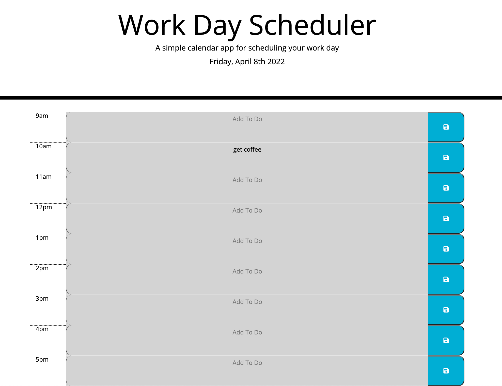

# 3rd-party-workdayscheduler

## User Story
This is a calendar covering traditional 9 to 5 workday hours. It is color coded to indicate past, present and future time blocks and features the ability to type in and add tasks to specific times. 

## Acceptance Criteria
The index.html is equipped with bootstrap, moment.js, and jquery libraries.  Bootstrap was used to add responsive rows, columns, buttons, and text areas.  Classes from the provided stylesheet were used to style bootstrap content and helped serve as a target for jQuery in the script sheet. Modified HTML by using jQuery to add current dates and times. The calendar is designed for the user to add tasks to time blocks with the click of a button, powered by an event listener and set up to store content into local storage.

Link to application:

